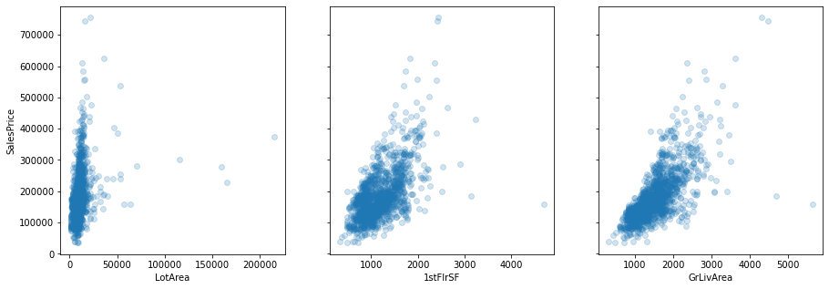
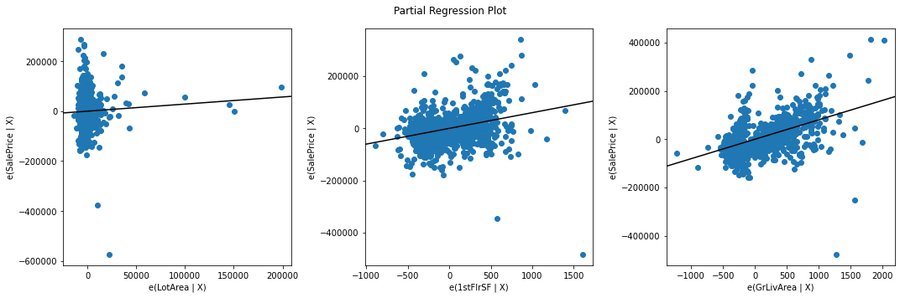

# Multiple Linear Regression in StatsModels 

## Introduction
In this lab, you'll practice fitting a multiple linear regression model on the Ames Housing dataset!

## Objectives

You will be able to:

* Perform a multiple linear regression using StatsModels
* Visualize individual predictors within a multiple linear regression
* Interpret multiple linear regression coefficients from raw, un-transformed data

## The Ames Housing Dataset

The [Ames Housing dataset](http://jse.amstat.org/v19n3/decock.pdf) is a newer (2011) replacement for the classic Boston Housing dataset. Each record represents a residential property sale in Ames, Iowa. It contains many different potential predictors and the target variable is `SalePrice`.


We will focus specifically on a subset of the overall dataset. These features are:

```
LotArea: Lot size in square feet

1stFlrSF: First Floor square feet

GrLivArea: Above grade (ground) living area square feet
```

## Visualizations of the Relationships Between Features and Target

For each feature in the subset, create a scatter plot that shows the feature on the x-axis and `SalePrice` on the y-axis.



All three of these features seem to have a linear relationship with SalePrice

1stFlrSF seems to have the most variance vs. SalePrice

All three have a few outliers that could potentially skew the resu


## The Multiple Linear Regression Models



LotArea seems to be a much weaker
predictor than it initially seemed. The partial regression plot is showing only the
variance in SalePrice that is not already explained by the other variables

1stFlrSF and GrLivArea look roughly the same as they did as standalone scatter
plots, although the slopes are not as steep.

